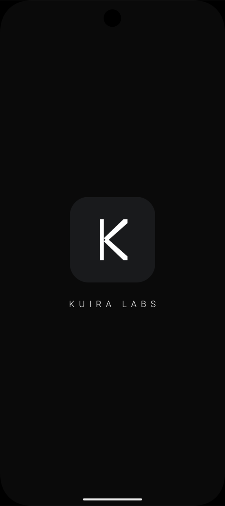
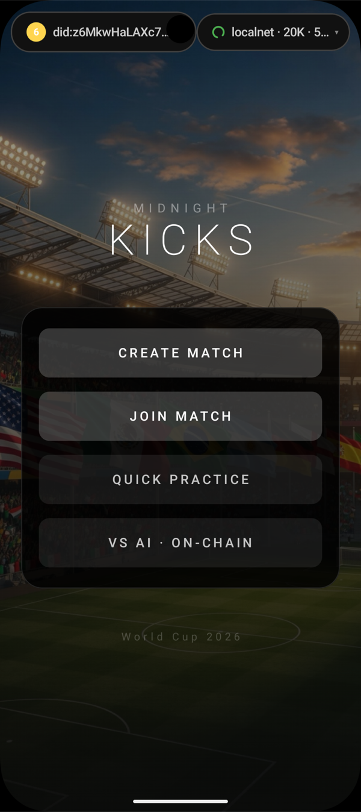
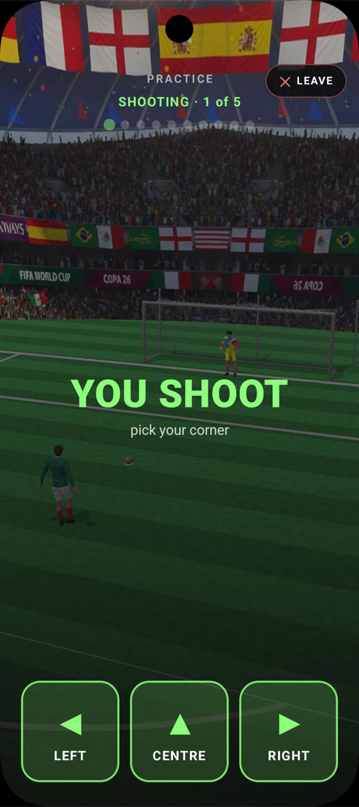

# Midnight Kicks

A ZK penalty shootout for Android — **Unity 3D + Kotlin (UaaL) + a Midnight Compact contract** acting as the on-chain referee. Two players, five rounds, commit-reveal so neither side can peek.

It's a standalone example app built on the published [Kuira Android SDK](https://kuiralabs.github.io/kuira-sdk-android/) (`io.github.kuiralabs`), aimed at the FIFA World Cup 2026 window.

<div align="center">
<table>
<tr>
<td align="center" width="33%"><br><sub><b>Built on the Kuira Android SDK</b></sub></td>
<td align="center" width="33%"><br><sub><b>Menu</b> — on-chain wallet + Sigil, create / join a match</sub></td>
<td align="center" width="33%"><br><sub><b>Shootout</b> — pick your corner, every shot proved on-device</sub></td>
</tr>
</table>
</div>

---

## What it demonstrates

A real, non-trivial dApp exercising the Kuira SDK end to end:

- **On-device ZK proving** — every move is proved on the phone (native Rust, no proof server).
- **Passkey Sigil identity** — one biometric forges the identity + wallet; no seed phrase.
- **Embedded self-custodial wallet** — funding, balances, and signing in-process.
- **Compact contract as referee** — `penalty.compact` (7 circuits) deployed at runtime; commit-reveal enforced on-chain so neither player can cheat.
- **Live match state** — a `StatePoller` reads the contract's typed ledger on a tick, so each player's moves surface as they land on-chain.
- **Cross-process resume** — a match survives the app being killed and reopened (encrypted `MatchStore`).
- **Unity ↔ Kotlin (UaaL)** — Unity runs the 3D replay; Compose owns all UI/HUD on top of it.

---

## Layout

```
midnight-kicks/
├── app/            Kotlin / Compose app — game logic, UI, SDK consumer
├── unity/          Unity 6 project — 3D stadium, run-up / dive replay
├── unityLibrary/   Exported Unity library (UaaL), consumed by app/
├── contract/       Compact contract (penalty.compact) + tests
├── docs/           Deeper docs (see bottom)
└── build-kicks.sh  Monorepo-only dev pipeline (rebuilds the SDK from source; see "Run it")
```

---

## Prerequisites

| Need | For | Notes |
|---|---|---|
| **JDK 17** | Gradle build | `java -version` → 17 |
| **Android Studio + Android SDK** | Build/run the app | `compileSdk 36` · `minSdk 30`. A fresh clone needs `local.properties` with `sdk.dir=/path/to/Android/sdk` — Android Studio writes it on first open, or create it by hand. |
| **A device or emulator on Android 13+ (API 33+), with a screen lock set** | Run the app | SDK `alpha05` ships `arm64-v8a` **and** `x86_64`, so a physical device or an Intel/Apple-silicon emulator both work. A screen lock is required for passkeys. |
| **Node.js 18+ and Compact `0.31.0`** | Compile the contract | `compact update 0.31.0`, then `compact --version` → `0.31.0` (produces runtime `0.16.0`). |
| **A Midnight localnet + a funded wallet** | Deploy the contract and play on-chain | Start it via Kuira's [Develop against a localnet](https://kuiralabs.github.io/kuira-sdk-android/integration/) guide (Docker stack + Midnight Wallet CLI). The `io.github.kuiralabs.localnet` Gradle plugin auto-runs `adb reverse` for the localnet ports on `installDebug`, so a physical device reaches the localnet running on your machine. |
| **Unity 6 — `6000.4.4f1`** | **Only** if you change the 3D side | Not needed just to build/run: the exported `unityLibrary/` is committed. |

Passkey identity is pre-wired to `rpId = kuiralabs.github.io` (whose `assetlinks.json` is already hosted), so Sigil onboarding works out of the box. If you fork with a new `applicationId`, host your own `assetlinks.json` and set your `rpId` — see [Bind your app to a passkey domain](https://kuiralabs.github.io/kuira-sdk-android/recipes/bind-your-app-to-a-passkey-domain/).

---

## Run it

The app consumes the **published** SDK (`io.github.kuiralabs:dapp-ui:0.1.0-alpha05`) from Maven Central — no SDK-from-source build and no Rust toolchain needed.

**1 · Compile the contract** — required; the build fails with a clear message if the managed artifacts are missing:

```bash
cd contract
npm install
npm run compact      # → compact compile src/penalty.compact ./src/managed/penalty
cd ..
```

This writes `contract/src/managed/penalty/`; the `io.github.kuiralabs.contract` plugin syncs it into the app's assets on every build.

**2 · Start your localnet** and fund the wallet — [localnet guide](https://kuiralabs.github.io/kuira-sdk-android/integration/).

**3 · Build + install** on a connected device/emulator:

```bash
./gradlew :app:installDebug
```

Or just assemble the APK: `./gradlew :app:assembleDebug` → `app/build/outputs/apk/debug/app-debug.apk`.

**4 · Play.** In the app: forge a Sigil (one biometric) → **Create Match** (deploys the penalty contract). On a second device, scan the match QR or open the `midnight://kicks?match=<address>` deep link to **Join**. Both players lock in moves (commit), reveal, and watch the 3D replay. Full flow: [`docs/GAME_DESIGN.md`](docs/GAME_DESIGN.md) §1.

> **Monorepo devs:** `./build-kicks.sh` is a convenience for building *inside* the Kuira monorepo — it also rebuilds the Rust FFI and republishes the SDK from source (it assumes `KUIRA_ROOT=../..`). A standalone clone does **not** need it; use the gradle commands above.

---

## Changing the Unity (3D) side

Unity is **pure 3D choreography** — stadium, run-up/dive replay, ball physics (`ShotManager`). All HUD/UI is a Compose overlay on the Kotlin side, so most gameplay and UI work happens in `app/`, not Unity. Touch Unity only for the 3D scene, models, materials, or audio.

1. **Open** `unity/` in **Unity 6 (`6000.4.4f1`)** — the exact version matters for UaaL compatibility.
2. **Edit** your scene / C# scripts / assets.
3. **Export the Android library:**
   - Editor: menu **Midnight Kicks → Export Android Library**
   - Headless: `Unity -batchmode -quit -projectPath unity -executeMethod ExportAndroidLibrary.Export`

   The export lands under `unity/build/android-export/…/unityLibrary/`.
4. **Sync the export into the app, then rebuild:**
   - In the monorepo: `./build-kicks.sh` — its first step copies a newer export over `./unityLibrary/`, then builds.
   - Standalone: copy the exported `unityLibrary/` over the repo's `./unityLibrary/`, then `./gradlew :app:installDebug`.

The app depends on the committed `unityLibrary/` module (`settings.gradle` → `include ':unityLibrary'`), so it runs the **last exported** Unity build until you re-export and sync.

---

## Docs

- [`docs/GAME_DESIGN.md`](docs/GAME_DESIGN.md) — spec: match state machine, commit-reveal protocol, contract circuits, and the Unity↔Kotlin bridge.
- [`docs/PLAN.md`](docs/PLAN.md) — project journal: architecture, milestone tracker, and SDK-friction notes.
- [`docs/UI_ROADMAP.md`](docs/UI_ROADMAP.md) · [`docs/VISUAL_ROADMAP.md`](docs/VISUAL_ROADMAP.md) — Unity visible-work checklist and the FC25-tier visual polish plan.
